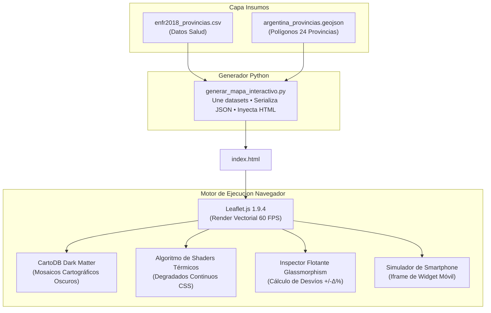

# ⚙️ Especificación del Motor Cartográfico Interactivo (Health GIS)
### *GeoSalud Argentina: Plataforma GIS y Widget Móvil (CIITI 2026)*

---

## 1. 📌 Descripción General

La carpeta **`Motor`** contiene el núcleo tecnológico de renderizado y visualización geoespacial de la plataforma. Este motor transforma los microdatos tabulares y polígonos vectoriales en un **tablero de control cartográfico de alta interactividad (Health GIS)** inspirado en la experiencia visual de radares meteorológicos modernos como **Windy.com**.

Funciona bajo el principio de **cero dependencias de servidor (Zero-Backend)**: se ejecuta directamente en cualquier navegador web moderno abriendo el archivo HTML local.

---

## 2. 📁 Archivos Incluidos en `Motor/`

```
Propuesta_Mapa_Interactivo_/Motor/
│
├── index.html                               <-- 🚀 Visualizador principal interactivo (Doble clic para abrir)
├── mapa_interactivo_diabetes_argentina.html <-- Copia de respaldo idéntica
├── generar_mapa_interactivo.py              <-- Script generador en Python que compila datos y HTML
└── README_MOTOR.md                          <-- Este documento técnico
```

---

## 3. 🏗️ Arquitectura del Motor



---

## 4. 🎨 Características Técnicas del Motor

### A. Capa Base de Alto Contraste (*CartoDB Dark Matter*)
Utiliza mosaicos vectoriales oscuros (`dark_all/{z}/{x}/{y}.png`). Al atenuar la trama urbana y los elementos topográficos secundarios, se maximiza el contraste lumínico de las anomalías de salud pública, permitiendo que los focos críticos brillen intensamente sobre el fondo negro azabache.

### B. Algoritmo de Interpolación de Colorimétrica No Lineal
En vez de usar divisiones toscas de 3 o 4 categorías fijas, el motor calcula una relación de intensidad normalizada para cada provincia:
$$\text{ratio} = \max\left(0, \min\left(1, \frac{v - v_{\min}}{v_{\max} - v_{\min}}\right)\right)$$
donde $v$ es el valor del indicador, mapeando dinámicamente el polígono al color exacto de la rampa:
* `Cian (#00f2fe)` ➔ Valores mínimos (baja prevalencia).
* `Amarillo (#facc15)` ➔ Valores medios.
* `Naranja (#f97316)` ➔ Valores moderados a altos.
* `Rojo Carmesí (#dc2626)` ➔ Valores críticos.
* `Púrpura Oscuro (#7f1d1d)` ➔ Picos máximos de alerta epidemiológica.

### C. Inspector Flotante HUD en Tiempo Real (*Glassmorphism*)
Al mover el cursor sobre cualquier provincia (o tocarla en pantallas táctiles):
1. El polígono activo se resalta con un borde cian brillante de $2.8\text{ px}$ y opacidad incrementada al $96\%$.
2. La tarjeta de vidrio esmerilado calcula instantáneamente el desvío respecto a la media del país:
   $$\Delta\% = \text{Valor}_{\text{provincial}} - \text{Media}_{\text{nacional}}$$
   desplegando una insignia verde si es favorable o roja si representa un exceso de riesgo.
3. Se actualizan simultáneamente las 6 métricas secundarias en la mini-grilla provincial.

### D. Navegación y Zoom Regional Instantáneo
Incluye botones con animación suave de cámara (`map.flyTo`) que encuadran regiones estratégicas con coordenadas y niveles de zoom calibrados:
* 🗺️ **País Completo:** Lat `-38.4`, Lon `-63.6`, Zoom `4`
* 🏙️ **CABA / AMBA:** Lat `-34.61`, Lon `-58.42`, Zoom `10`
* 🌵 **NOA:** Lat `-26.8`, Lon `-65.2`, Zoom `6`
* 🌿 **NEA:** Lat `-27.4`, Lon `-58.9`, Zoom `6`
* 🍇 **Cuyo:** Lat `-31.5`, Lon `-68.5`, Zoom `6`
* 🏔️ **Patagonia:** Lat `-45.8`, Lon `-69.0`, Zoom `5`

### E. Simulador de Celular Integrado
El motor incluye en su barra superior el botón **`📱 Ver Modo Widget Celular`**, que abre una ventana modal con el marco tridimensional de un smartphone de última generación, ejecutando el widget de bolsillo para demostraciones directas ante jurados o auditorios.

---

## 5. 🛠️ Cómo Regenerar o Actualizar el Motor

Si se agregan nuevas capas o se actualizan los datos de la ENFR, basta con ejecutar en la terminal:

```powershell
python Propuesta_Mapa_Interactivo_/Motor/generar_mapa_interactivo.py
```
El script leerá automáticamente los insumos de la carpeta `Datos/` y reescribirá `index.html` con todos los estilos, geometrías y lógica empaquetados.
