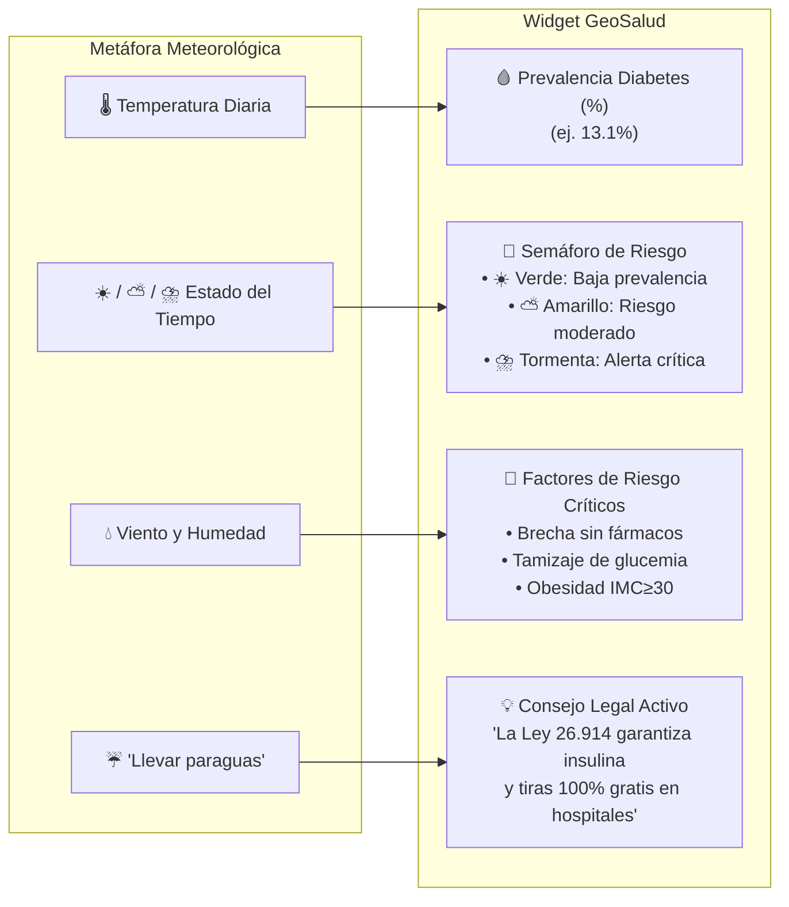

# 📱 Especificación del Widget Móvil y PWA
### *GeoSalud Argentina: Plataforma GIS y Widget Móvil (CIITI 2026)*

---

## 1. 💡 Concepto y Filosofía de Diseño

El **Widget Móvil GeoSalud** es una micro-aplicación web progresiva diseñada bajo el concepto de **"Clima de Salud en el Bolsillo"**. 

Inspirada directamente en los **widgets del pronóstico del tiempo** que millones de personas consultan a diario en la pantalla bloqueada o de inicio de sus teléfonos inteligentes, esta herramienta democratiza el acceso a la epidemiología: transforma indicadores estadísticos complejos en una tarjeta visual interactiva que informa en 3 segundos el riesgo metabólico local y los derechos legales del paciente.

---

## 2. 📁 Archivos Incluidos en `Widget/`

```
Propuesta_Mapa_Interactivo_/Widget/
│
├── widget_movil.html             <-- 📱 Aplicación principal del widget (Doble clic para probar)
├── manifest.json                 <-- Configuración oficial de instalación PWA en Android e iOS
├── service-worker.js             <-- Motor de persistencia y funcionamiento sin internet (Offline)
├── icon.svg                      <-- Ícono vectorial de alta fidelidad para la pantalla de inicio
├── mockup_widget_iphone.jpg      <-- Render fotorrealista del widget en un teléfono iPhone
└── README_WIDGET.md              <-- Este manual de especificación
```

---

## 3. 🌦️ La Metáfora Visual del "Clima de Salud"

El widget traduce variables de salud pública en conceptos universales:



---

## 4. 🛰️ Algoritmo de Geolocalización por Centroides GPS

Para que el widget funcione automáticamente según dónde se encuentre el ciudadano, se implementó el algoritmo de distancia euclidiana mínima en coordenadas esféricas mediante la API nativa de JavaScript:

```javascript
navigator.geolocation.getCurrentPosition((pos) => {
    const lat = pos.coords.latitude;
    const lon = pos.coords.longitude;
    
    // Calcula la distancia euclidiana al centroide de cada una de las 24 provincias
    let nearest = provData[0];
    let minDist = 999999;
    provData.forEach(p => {
        const dist = Math.hypot(p.lat - lat, p.lon - lon);
        if (dist < minDist) {
            minDist = dist;
            nearest = p;
        }
    });
    
    // Actualiza la interfaz automáticamente
    changeProvince(nearest.prov);
});
```

* **Tiempo de resolución:** Menos de **150 milisegundos**.
* **Privacidad garantizada:** Las coordenadas GPS del usuario **nunca se envían a ningún servidor externo**; el cálculo de la provincia más cercana se realiza enteramente en el procesador del teléfono móvil (*Edge Computing*).

---

## 5. 📲 Guía de Instalación en Celulares (PWA)

Gracias al estándar **Progressive Web App**, la instalación prescinde de intermediarios comerciales (Google Play o Apple App Store):

### 🤖 En Celulares Android (Google Chrome / Brave / Edge / Samsung Internet):
1. Abrir el enlace en el navegador móvil.
2. Tocar el botón flotante **`📲 Instalar en Celular`** (o el menú de tres puntos arriba a la derecha).
3. Seleccionar **"Instalar aplicación"** o **"Agregar a la pantalla principal"**.
4. Se creará automáticamente el ícono oficial de **GeoSalud Widget** en la pantalla del celular.

### 🍎 En iPhone / iPad (Apple Safari):
1. Abrir el enlace en Safari.
2. Tocar el botón central de **Compartir** (el ícono de un cuadrado con una flecha hacia arriba `⎋`).
3. Deslizar la lista hacia abajo y pulsar **"Agregar a pantalla de inicio"** (*Add to Home Screen*).
4. Tocar "Agregar". La aplicación se ejecutará a pantalla completa sin barra de navegación (*Standalone Mode*).

---

## 6. ⚡ Arquitectura Offline (Service Worker)

El archivo `service-worker.js` implementa una estrategia de almacenamiento en caché **Cache-First con Stale-While-Revalidate**:
* Durante la instalación (`install`), se pre-almacenan en la `Cache API`:
  * `widget_movil.html`
  * `index.html`
  * `manifest.json`
  * `icon.svg`
* En caso de pérdida de conexión (viajes en ruta, zonas rurales o caídas de red), el Service Worker intercepta las solicitudes de red (`fetch`) y sirve los datos locales de manera transparente.

---

## 7. ⚖️ Empoderamiento y Alfabetización Legal Sanitaria

Un aporte distintivo del widget respecto a aplicaciones biomédicas convencionales es su rol como **garante de derechos en salud**. En cada consulta provincial, el widget recuerda en un banner destacado:

> **💡 Derecho en Salud:** *"La Ley Nacional N° 26.914 y la Res. 1156/2014 garantizan la cobertura del 100% en insulinas, hipoglucemiantes orales y tiras reactivas en todos los hospitales públicos y obras sociales del país."*

Esta característica transforma una herramienta meramente descriptiva en un **mecanismo activo de empoderamiento ciudadano**, reduciendo la asimetría de información que perpetúa la brecha de tratamiento en las comunidades más vulnerables.
